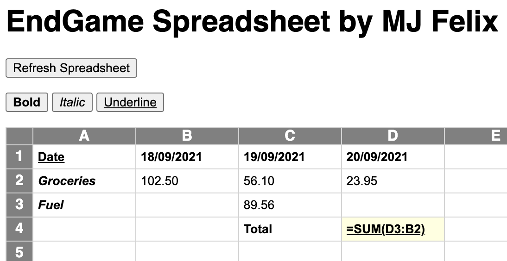

# EndGame Spreadsheet



Programming task for the position of [Full Stack Software Engineer at EndGame](https://www.end-game.com/career/full-stack-software-engineer).

## Table of Contents

  - [Description](#description)
  - [Scope of Functionalities](#scope-of-functionalities)
  - [Technologies/Components](#technologiescomponents)
  - [Installation Notes](#installation-notes)
  - [Backlog (unproritised)](#backlog-unprioritised)
  - [Contact](#contact)

## Description

EndGame Spreadsheet is a simple spreadsheet built using pure JavaScript.

## Scope of Functionalities

 - Entering numbers or strings
 - Simple arithmetic formulas, e.g. `=(A1+A2)*3-B3`
 - SUM formula, e.g. `=SUM(C3:A1)`
 - Formatting of cells (bold, italic, underline)
 - Repaint/refresh the spreadsheet (to prove data is saved in JavaScript object)


## Technologies/Components

Only pure JavaScript is used.

## Installation Notes

### Clone GitHub repository

```
git clone https://github.com/mj-felix/end-game-spreadsheet.git
```

### Run web app

Open `end-game-spreadsheet/index.html` in your favourite browser.

## Backlog (unprioritised)

1. Introduce erase data functionality
2. Replace innerHTML with createElement
3. Private fields and methods (but be careful with Safari) - [MDN link](https://developer.mozilla.org/en-US/docs/Web/JavaScript/Reference/Classes/Private_class_fields)
4. Divide code into separate files/modules to improve readability
5. Rethink formula parsing + handle new formulas:
   - Elicit reqs
   - Trim, remove white spaces
   - Prevent code injections
   - Replace SUM(A1:B2) with (A1+B1+A2+B2) before calculating the result
   - Rethink side effects like updating the source cell's `impactedCellIds` 
   - ...
6. Do not allow the user to overwrite JS code (Object.freeze... etc)
7. Better error handling and user alerting
8. Use key shortcuts for formatting - `if (event.key === 'b' && (event.metaKey || event.ctrlKey)) { }`
9. Replace cell listeners with one listener higher in the DOM tree and use `event.target` to identify the source (performance improvement)
10. Handle circular references/cell dependencies
11. Refactor saveCell into 2 separate methods for input and blur events

## Contact

MJ Felix<br>
[mjfelix.dev](https://mjfelix.dev)<br>
mjfelixdev@gmail.com<br>
[linkedin.com/in/mszonline](https://www.linkedin.com/in/mjfelix/) 
